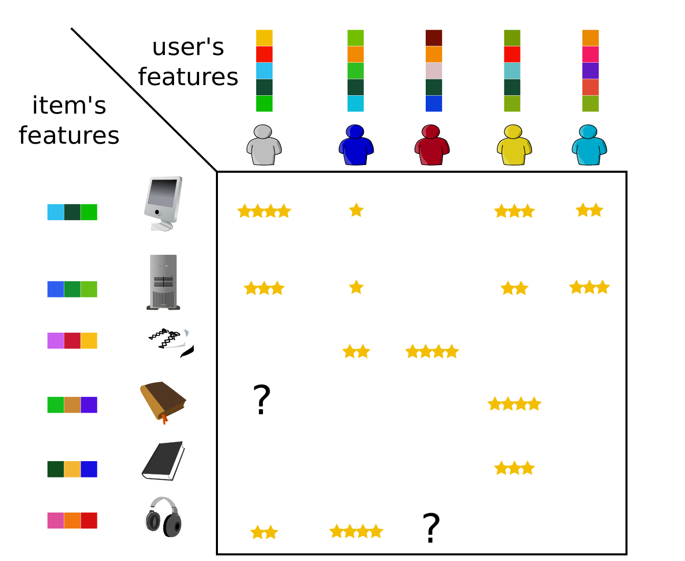

# Movie Recommendation System

This group project aims to predict missing entries in a movie-user ratings matrix from the MovieLens dataset. The codebase is organized into modular components for data preprocessing, matrix completion algorithms, evaluation metrics, and utilities.

## Documents
For context and overview of the work achieved one can refer to these resources :
- Short report presenting our main ideas and results ([report.pdf](docs/report.pdf))
- Slides for the project presentation ([slides.pdf](docs/slides.pdf))

